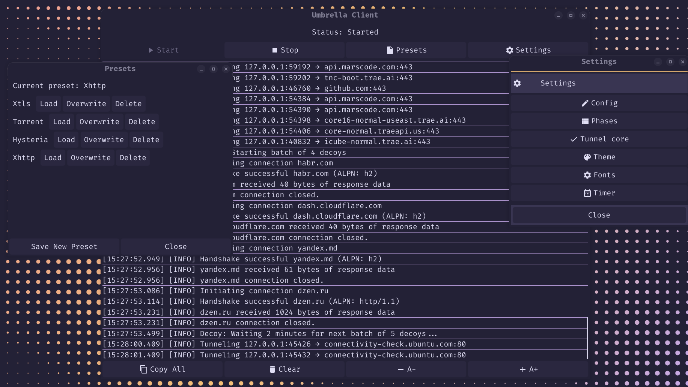

#  Umbrella Protocol

A comprehensive censorship circumvention solution that combines several different traffic masking strategies into one application. My experimental and research project.

---

## Umbrella Strategies

The project implements several protocols, each optimized for its own tasks and featuring custom enhancements (see more details in the .md files):

### 1. Hysteria 2

* **Base:** QUIC (UDP) with BBR.
* **Masking:** Masquerading as HTTPS + Random padding at the packet level.
    - In Umbrella, Masquerade is modified to the XTLS Reality level with anti-probing protection.
    - Uses a patch of the [hysteria](https://github.com/Haonixao/hysteria) library, which adds packet-level Random padding and capabilities for custom authentication.
*   [Details in hysteria.md](./docs/protocols/hysteria.md)

### 2. XTLS Reality + Vision

* **Base:** TCP (TLS 1.3).
* **Masking:** Identity theft (Reality) of a legitimate site + "tinting" Vision.
    - Vision in Umbrella is modified for constant masking of both TLS-in-TLS signatures and all useful application traffic through constant Random padding.
*   [Details in xtls.md](./docs/protocols/xtls.md)

### 3. Torrent Stealth

* **Base:** uTP (UDP) over BitTorrent Piece-framing.
* **Masking:** Behavioral imitation of a torrent client + White Noise (tracker requests) + Random padding.
* Uses a patch of the [uTP](https://github.com/Haonixao/utp) library, which removes limits and forces the protocol to attempt maximum speed.
*   [Details in torrent.md](./docs/protocols/torrent.md)

### 4. XHTTP

* **Base:** HTTP/2 (TCP) or HTTP/3 (QUIC/UDP).
* **Masking:** Masquerading as standard browser HTTPS traffic using legitimate ALPNs (`h2`,    `h3`).
    - **Silent IP Activation:** A "Knock" mechanism validates the client's IP via magic fields in the TLS/QUIC handshake (SessionID or ConnectionID) **before** any HTTP requests are made.
    - **Double Padding:** Random noise is added to both HTTP headers (`X-Padding`) and data frames (`[DataLen][PaddingLen]`).
    - **Zero-Signature:** After IP activation, the client uses standard handshakes and headers, making the tunnel indistinguishable from regular web activity.
*   [Details in xhttp.md](./docs/protocols/xhttp.md)

---

## General Protection Technologies (for all protocols)

### Shaper

Dynamic traffic shaping. Allows imitating page load patterns, API calls, or simply limiting speed (Limiter) to avoid attracting attention with anomalous spikes.

[Details in shaper.md](./docs/shaper.md)

### Decoy Traffic

The Decoy module operates at the application level:
*   Generates infrequent (once every 1-5 minutes) direct requests to popular resources (Bing, Yahoo, Apple, Intel, etc.).
*   Blurs IP connection statistics in the eyes of the ISP: your IP communicates not only with the VPS but also with a dozen legitimate global services.
*   Low traffic consumption without sacrificing stealth.

---

## Umbrella Server

The server supports all modes. The configuration is flexibly adjustable to the chosen protection strategy. 

[Server setup details in setup_guide.md](./docs/setup_guide.md)

---

## Umbrella Client (Fyne UI)

A modern graphical interface providing full control over the tunnel and system settings.

### Main features and windows:

* **Main Screen** : 
  + Large Start/Stop button for instant control.
  + Virtualized log (widget. List) with support for copying lines on click.
  + Status indicators and current mode.
  + Quick control of log font size.
* **Settings Window** :
  + **Config Editor** : Built-in `config.yaml` editor (structure validation before saving).
  + **Phase Editor** : Configuring Shaper behavior through a phase editor.
  + **Presets** : A system for saving and instantly switching between setting profiles.
  + **Tunnel Core** : Integration with third-party tools (Mihomo, sing-box, ProxiFyre).
* **Personalization** :
  + **Themes** : Choice of several predefined themes.
  + **Fonts** : Ability to install custom fonts (.ttf/.otf) for the entire interface.
* **Tools** :
  + **Timer** : Automatic tunnel shutdown on schedule.

---

## Masking Tips

### For XTLS

* Use sites that are not blocked in your region but are located outside the country as `sni` and `dest` (e.g., samsung.com, intel.com)
* Enable `decoy-traffic` to blur statistics.

### For Torrent

* Specify the hash of a popular torrent (e.g., a current Ubuntu or Debian image) in `info-hash`.
* If your VPS allows, use a wide range of ports in `port`.

---

## Build and Usage

[Full instructions for building, deploying, and configuring are provided in setup_guide.md](./docs/setup_guide.md)

* **The client must be run as administrator (or with `sudo` on Linux) to correctly launch Mihomo, sing-box, and ProxiFyre. When manually launching tunneling tools, it can be run without administrator privileges** 
* **Sometimes errors occur related to a blocked port (even if no one is using it). If the application doesn't handle it automatically, the commands `net stop winnat && net start winnat` (Windows) and `sh -c fuser -k 1080/tcp` (Linux) will help** 

---
